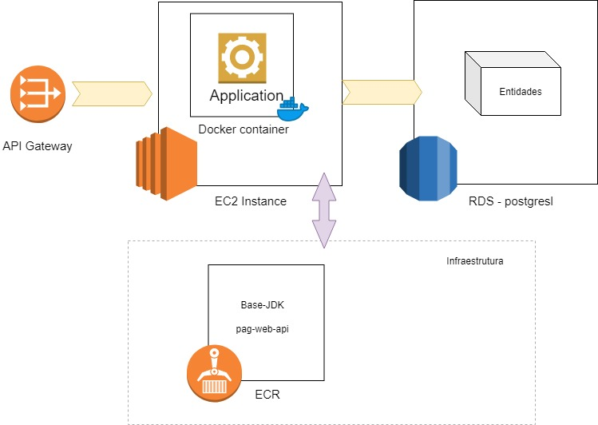

> **Modelo de dados:** 


> **URL da aplicação:** 

#### Base:
https://32jvr5dtie.execute-api.us-east-2.amazonaws.com/pag-api/

#### Swagger:
https://32jvr5dtie.execute-api.us-east-2.amazonaws.com/pag-api/swagger-ui.html

#### Postman collection:
[postman](pag-api.postman_collection.json)

> **Desenho da aplicação:** 



> **Ambiente de desenvolvimento:**

#### Postgresql local

```bash
docker run --name postgres-container -e "POSTGRES_PASSWORD=postgres" -p 5432:5432 -d postgres
```

```bash
docker cp ./sql.sql postgres-container:/sql.sql
```

```bash
docker exec -it postgres-container psql -U postgres -W postgres -d pag -f /pag.sql
```

#### Para rodar a aplicação

```bash
mvn clean package
```

```bash
java -jar target/pag-web-api-0.0.1-SNAPSHOT.jar
```

#### Acesso local

http://localhost:8080


> **Orientação de uso da API:**


1) Inserir um Cliente
    ```json
    {
        "nome": "Jose Simplório",
        "cpf": "12345678900",
        "data_nascimento": "2000-10-10"
    }
    ```
    - Guardar o ID do cliente retornado
2) Inserir um produto
    ```json
    {
        "nome": "biotonico fontoura",
        "preco_sugerido": "22.22"
    }
    ```
    - Guardar o ID do produto retornado
3) Criar um Pedido
    ```json
    {
        "cliente": {"id": <ID_CLIENTE_PASSO_1>}
    }
    ```
    - Guardar o ID do pedido retornado
4) Adicionar Item ao pedido (id do pedido passado na URL)
    ```json
    {
        "produto": {"id": <ID_PRODUTO_PASSO_2>},
        "preco": 10.10,
        "quantidade": 3
    }
    ```

O swagger é seu amigo:
https://32jvr5dtie.execute-api.us-east-2.amazonaws.com/pag-api/swagger-ui.html

> **Exemplo de de requisição - POST Cliente**

POST: localhost:8080/cliente

BODY:
```json
{
        "nome": "Jose Simplório",
        "cpf": "12345678900",
        "data_nascimento": "2000-10-10"
    }
```

#### CURL

```curl
curl -X POST \
  http://localhost:8080/cliente \
  -H 'Content-Length: 140' \
  -H 'Content-Type: application/json' \
  -H 'Host: localhost:8080' \
  -H 'Postman-Token: 
  -H 'cache-control: no-cache' \
  -d '{
        "nome": "Jose Simplório",
        "cpf": "12345678900",
        "data_nascimento": "2000-10-10"
    }'
```

#### Exemplo de de requisição - GET Cliente (listagem)

GET: localhost:8080/cliente

Resposta:

```json
[
    {
        "nome": "Jose Simplório",
        "cpf": "12345678900",
        "data_nascimento": "2000-10-10"
    }
]
```


> **Execução do docker em prod**

```bash
 docker run -d --rm -e SPRING_PROFILES_ACTIVE=prod -p 80:8080 965946547559.dkr.ecr.us-east-2.amazonaws.com/pag-web-api:latest
 ``` 