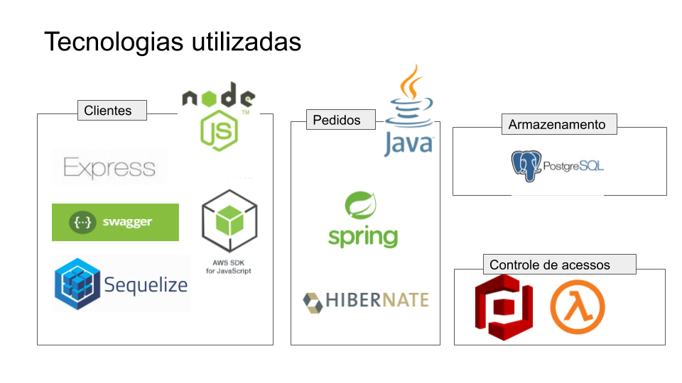

# Visão Geral 

O desafio foi enxergado como uma solução escalar, por tanto, foram criados serviços diferentes usando tecnologias diferentes, visando entregar serviços menos suscetíveis a erros e de fácil manutenção nas suas regras e integrações.

Foram criados os seguintes serviços: 

 - [Orders-api](https://github.com/gcamargosilva/quero-ser-paguer-backend/tree/feature/orders-api/orders-api) - Para manipulação do pedido e produtos 
 - [Client-Api](https://github.com/gcamargosilva/quero-ser-paguer-backend/tree/feature/orders-api/clients-api) - Para manipulação de clientes e usuários
 - [cognito-redirect-group](https://github.com/gcamargosilva/quero-ser-paguer-backend/tree/feature/orders-api/lambdas/cognito-redirect-group) - Redireciona o usuário para o grupo quando o email é confirmado.

## Tecnologias utilizadas
Cada tecnologia foi escolhida de acordo com a complexidade do serviço (utilizar Java foi sair da minha zona de conforto - Não que isso seja algo ruim)
Por exemplo, um cadastro de um cliente é ligeiramente simples, e as integrações com a AWS é muito mais simples com JS, algumas carregam apenas uma linha de código, logo essa era a melhor Stack para se trabalhar no modelo de cadastro. 

Já quando enxergamos Pedidos, pedidos tem uma complexidade enorme, pois o mesmo pode envolver estoque, status e até políticas de estorno, se fosse escrita em JS poderia gerar um código "ilegível" e de difícil manutenção. Por isso foi adotada uma linguagem orientada a objeto pois se dá melhor com regras de negócio complexas

Sendo assim, a stack do desafio ficou assim: 

Além disso são utilizados recursos da AWS tais como 
 

 - Api gateway (Para recursos da API de clientes)
 - RDS (Com postgres )
 - Cognito 
 - Elastic Beanstalk (Com docker para a API de cliente)

## Testes
Caso queira efetuar testes locais e debug solicite-me o .env do Node.

Ou você pode importar o Desafio.postman_collection para o Postman e efetuar as requisições direto nos ambientes
 

 
